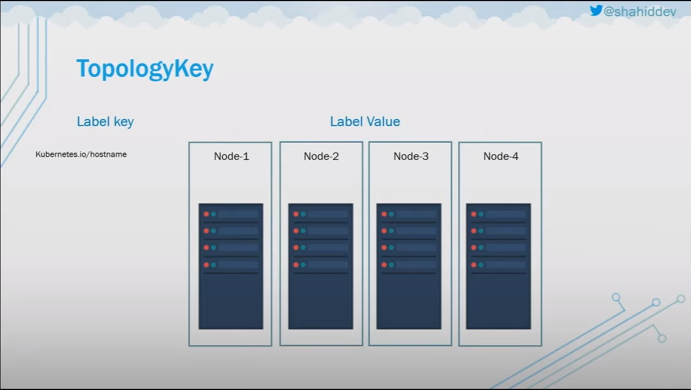
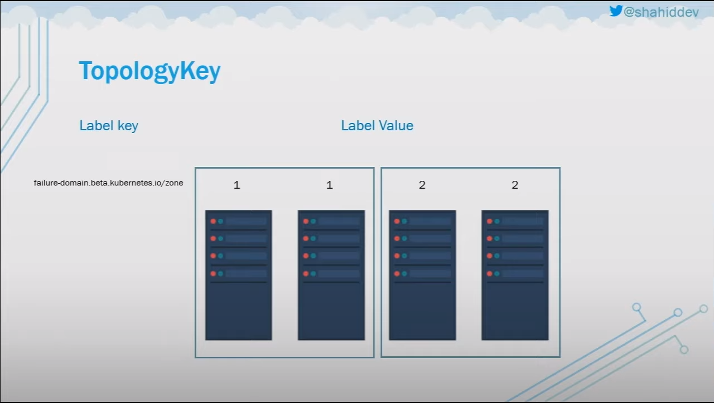
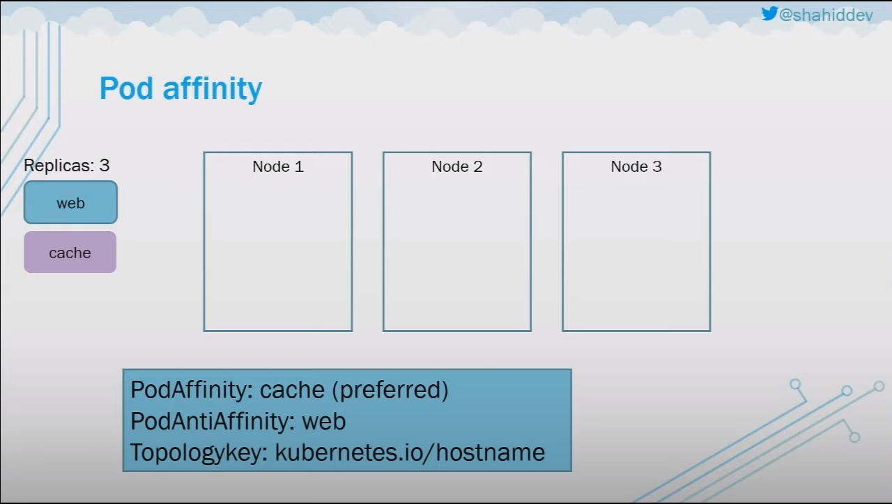
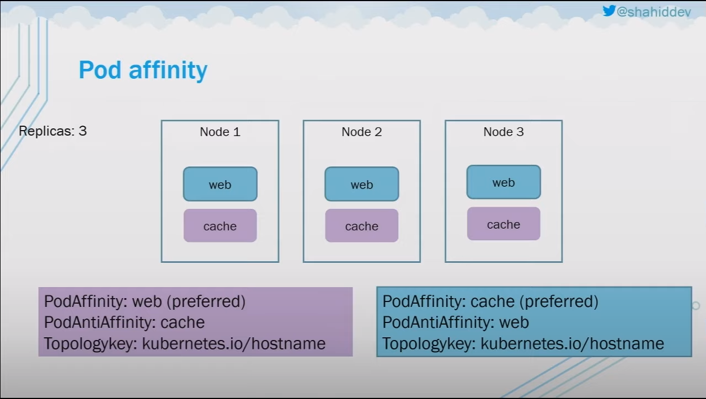
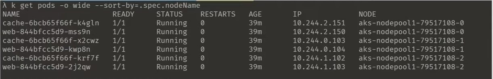

# Kuberenetes Pods Scheduling


## What Is Pods Scheduling?

Pods Scheduling is the process of assigning Pods to Nodes in the cluster.

## Why Affect/Control Pods Scheduling?

- Hetrogenous cluster with specialized hardware/software
- Allocate teams to nodes
- Regulatory requirements
- Application architecture

## How To Control Pods Scheduling?

- Node Seclector
- Node Affinity/Anti-Affinity
- Node taints/tolerations
- Pod Affinity/Anti-Affinity
- Custom Scheduler

### Node Seclector

Node Seclector is a field of PodSpec. It specifies a map of key-value pairs. For the pod to be eligible to run on a node, the node must have each of the indicated key-value pairs as labels (it can have additional labels as well). The most common usage is one key-value pair.

- Add key-value pair label to the node object

```bash
# kubectl label node <node-name> key=value
kubectl label node <node-name> team=team1
```

- Add matching label to the pod/deployment object in the nodeSelector field

```yaml
apiVersion: v1
kind: Pod
metadata:
    name: <pod-name>
    labels:
        team: team1
spec:
    nodeSelector:
        team: team1
    containers:
        ...
```

- Notes:
    - If multiple nodes with the same label exist, the pod will be scheduled on any of them
    
- Issues: 
    - Labeling is not a guarantee of running on a node
    - If no node with the label exists, the pod will not be scheduled

### Node Affinity/Anti-Affinity

Node Affinity/Anti-Affinity is a set of rules used by the scheduler to determine where a pod can be placed. The rules are defined using custom labels on nodes and label selectors specified in pods.

Allows nodes to attract pods based on labels!

Match on conditions rather than exactly matching key-value pair.
"In", "NotIn", "Exists", "DoesNotExist", "Gt", "Lt"

Can be selective on how demanding you are to a particular node.

- Examples:
    - `requiredDuringSchedulingIgnoredDuringExecution`
        - Hard requirement => Pod might not schedule same as Node Selector
    - `preferredDuringSchedulingIgnoredDuringExecution`
        - Soft requirement => Pod will get scheduled
    - `requiredDuringSchedulingRequiredDuringExecution`
        - Not Implemented Yet

- RequiredDuringSchedulingIgnoredDuringExecution

```yaml
apiVersion: v1
kind: Pod
metadata:
    name: <pod-name>
    labels:
        team: team1
spec:
    nodeAffinity:
        requiredDuringSchedulingIgnoredDuringExecution:
            nodeSelectorTerms:
            - matchExpressions:
              - key: team
                operator: In
                values:
                - team1
                - team3
            - matchExpressions:
              - key: team
                operator: NotIn
                values:
                - team2
```
- PreferredDuringSchedulingIgnoredDuringExecution

The weights are used to determine which node is preferred. becuase there might be multiple nodes with the same label, the pod will be scheduled on the node with the highest weight.

```yaml
apiVersion: v1
kind: Pod
metadata:
    name: <pod-name>
    labels:
        team: team1
spec:
    nodeAffinity:
        preferredDuringSchedulingIgnoredDuringExecution:
            weight: 100
            preference:
                nodeSelectorTerms:
                - matchExpressions:
                    - key: team
                    operator: In
                    values:
                    - team1
```

### Taints/Tolerations

Allows nodes to **repel** pods based on taint. (Do not put any pods on this node unless they exipictly tolerate the node taint.)
Nodes are tainted, and Pods tolerate the taint.

- Define key, value, and effect
- Effects
    - `NoSchedule`: Don't schedule at all.
    - `PrefereNoSchedule`: If there's nothing else (no other available nodes) then schedule.
    - `NoExecute`: Kick of running nodes after applying taints.
Notes:
    - K8s add taints to nodes in certain circumstances (node problems)
    - Existing/Running pods can be evicted if a node is tainted

- Taint a node:
```bash
# kubectl taint nodes <node-name> key=value:effect
kubectl taint nodes <node-name> team=team1:NoSchedule
```

- Make the Pod tolerate the NoSchedule Taint
```yaml
apiVersion: v1
kind: Pod
metadata:
    name: <pod-name>
    labels:
        team: team1
spec:
    tolerations:
        - key: team
          operator: Equal
          value: team1
          effect: NoSchedule
```

### Taints vs Affinity

- With Node affinity any Pod could be scheduled on unless the Pod explicitly sets node anti-affinity - Node has no say in the matter.
- Taints allow Nodes to repel Pods unless they tolerate the taint. (Including currently running Pods!)
- Use Taints to prevent "casual scheduling" on certain Nodes (For example when you have limited/expensive resource)


### Pod (Inter-Pod) Affinity/Anti-Affinity

Select nodes used for pod based on what other pods are running at.

- Useful for ensuring certain components/pods run on same node. (For example; caching alongside the app)
- Useful for ensuring certain components/pods don't run on the same node/zone.
- Same constructs for indecating strictness
    - `requiredDuringSchedulingIgnoredDuringExecution`
    - `preferredDuringSchedulingIgnoredDuringExecution`
- Additional key `TopologyKey`:
    - References a node label
    - The level of infrastructure that is used to apply the rules (hostname, failure domain, availability zone)
    
    

- Example

This example means this app/pod wants to be in the same hostname group as the cache pod. (because it's a podAffinity) if it was podAntiAffinity, then it should be in a different hostname group.

```yaml
apiVersion: v1
kind: Pod
metadata:
    name: <pod-name>
    labels:
        team: team1
spec:
    affinity:
        podAffinity:
            requiredDuringSchedulingIgnoredDuringExecution:
                - labelSelector:
                    matchExpressions:
                    - key: component
                      operator: In
                      values:
                      - cache
                    topologyKey: kubernetes.io/hostname
containers:
    ...
```
- Another Example

- For the `web` App: 

    - `PodAffinity: cache (preferred)`: means it should be closer to the cache pods.
    - `PodAntiAffinity: web` : means it should repel itself `web` pods which will force the 3 replicas of the `web` app to run on the three different nodes.
    - `Topologykey: kubernetes.io/hostname`: means the way to split the nodes is by the hostname
- For the cache App:

    - `PodAffinity: web (preferred)`: means it should be closer to the web pods.
    - `PodAntiAffinity: cache` : means it should repel itself `cache` pods which will force the 3 replicas of the `cache` app to run on the three different nodes.
    - `Topologykey: kubernetes.io/hostname`: means the way to split the nodes is by the hostname
- Result

