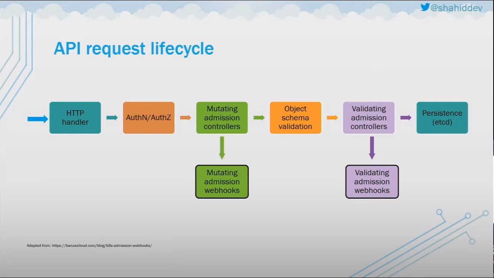
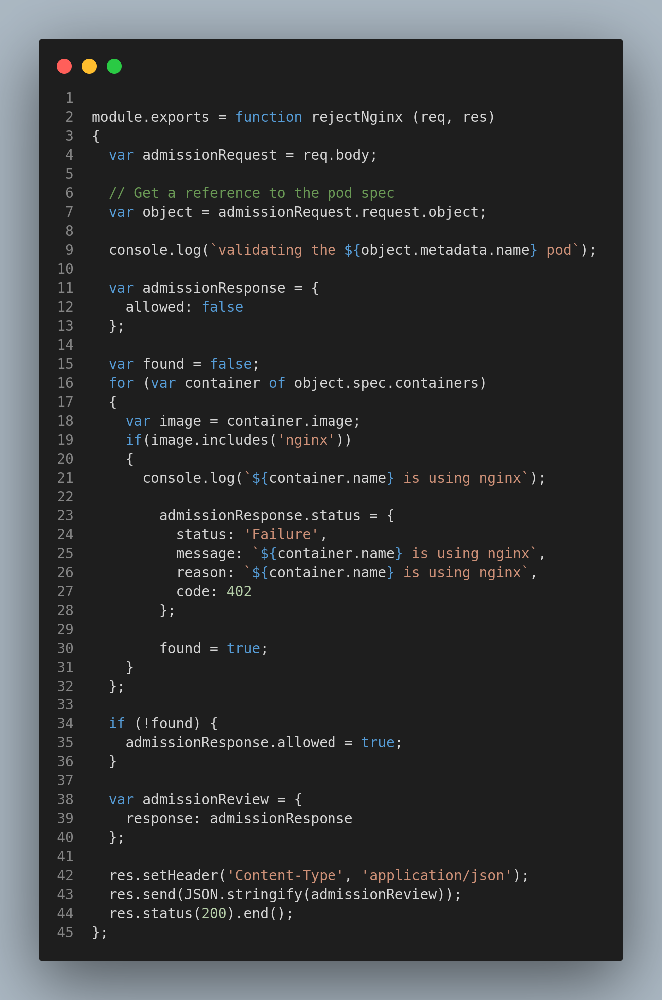

# Kubernetes Admission Control - Taking More Control

We might want to have more control over the created resources.
- Apply custom policies to resources (e.g. must have labels with specific naming convention.)
- Prevent creation of certain resources
- Inject additional logic transparently into resources (like what istio does)

## Admission Control

Code that intercepts the API server request, inspect, modify, or reject it, before they are persisted.

Controllers can be:
- Validating - can inspect the objects but not modify
- Mutating - can modify the objects
- Both

Controllers can be enabled/disabled using kube-apiserver (Limited options on managed K8s providers because you don't have access to the api server)

## Built-in Admission Controllers in Kubernetes

- NamespaceLifecycle
- LimitRanger
- ServiceAccount
- PersistentVolumeClaimResize
- DefaultStorageClass
- DefaultTolerationSeconds
- MutatingAdmissionWebhook
- ValidatingAdmissionWebhook
- ResourceQuota
- Priority

To understand how Admission Controllers work, and where the controllers fit in we need to understand the API request lifecycle.

## API Request Lifecycle



- The mutating admission webhooks, and the validating admission webhooks are were we can inject custom admission controllers.

## Admission Webhooks

Allows to modify/validate the request before it is persisted, without the need to modify the apiserver itself.

Implemented by to two "special" admission controllers
- MutatingAdmissionWebhook - modifies/creates resources
- ValidatingAdmissionWebhook - validates/blocks resources creation

Controllers invoke HTTP callback
- Logic doesn't need to be compiled into the apiserver
- Logic doesn't have to live in a specific place, it can be inside/outside the cluster 
- It just needs access to the apiserver

## Example Validating Admission Controller in Java Script

The next JavaScript code is an example validation admission controller rejecting containers with Nginx images.



- You can find the code at [Reject Nginx Images Custom Controller](./reject-nginx-controller/)

- You can then deploy the custom controller as a cloud function, our deploy the whole api server on any platform.

## Example Validating WebHook that is using Reject Nginx custom controller

```yaml
apiVersion: admissionregistration.k8s.io/v1
kind: ValidatingWebhookConfiguration
metadata:
  name: reject-nginx
webhooks:
- name: reject-nginx
  rules:
    - apiGroups: [""]
      apiVersions: ["v1"]
      operations:  ["CREATE"]
      resources:   ["pods"]
  failurePolicy: Ignore
  clientConfig:
    url: "https://10.244.0.6:3000/api/rejectNginx"
  admissionReviewVersions: ["v1"]
  sideEffects: None
```

```bash
kubectl apply -f k8s/webhook/webhook.yaml
```


